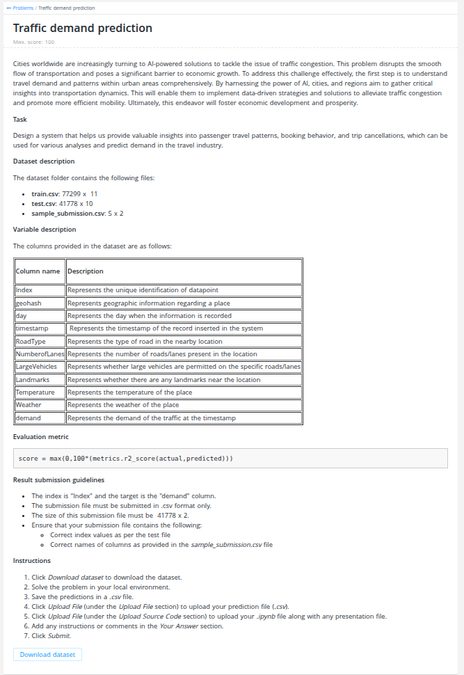

# Flipkart Gridlock 2.0 — Traffic Demand Prediction

**Hackathon:** Flipkart Gridlock 2.0  
**Task:** Predict normalized traffic demand (0–1) for geographic zones at specific timestamps  
**Metric:** `max(0, 100 × R²)` — Best score: **91.798**  



---

## Problem

Given historical traffic data across ~1,200 geohash zones (day 48), predict demand for 47 timestamps on day 49. The core challenge: **distribution shift** — training data covers early-morning hours (0:00–2:00), while test data spans daytime (2:15–13:45).

### Dataset

| Split | Rows | Timestamps | Geohashes |
|-------|------|------------|-----------|
| Train | 77,299 | 96 (days 48–49) | 1,249 |
| Test  | 41,778 | 47 (day 49 only) | 1,190 |

**Columns:** `geohash, day, timestamp, demand, RoadType, NumberofLanes, LargeVehicles, Landmarks, Temperature, Weather`  
**Target:** `demand` — float in [0, 1], right-skewed (72% of rows < 0.1)

Sample data: [`data/sample_train.csv`](data/sample_train.csv) · [`data/sample_test.csv`](data/sample_test.csv)

---

## Approach

### Feature Engineering

- **`demand_lag`** — Day 48 demand for same (geohash, timestamp). Strongest single feature (corr = 0.79)
- **`d48_window_mean`** — ±4 timestamp rolling mean from day 48 (corr = 0.96)
- **`d48_lag1/lag2/lead1/lead2`** — Neighboring timestamp lags (corr = 0.93–0.95)
- **`geo_day_trend`** — Per-geohash ratio of day 49 / day 48 mean demand
- **OOF target encodings** — 5 types: geo×hour, gh5×hour, geohash, RoadType×hour, geo×time_slot
- **Spatial features** — lat/lon from geohash decode, gh4/gh5 prefix groupings
- **Cyclical time** — hour_sin/cos, time_slot

### Model

3-way GBT ensemble — weighted average of LightGBM (20%), XGBoost (15%), CatBoost (65%):

| Model | OOF R² | Config |
|-------|--------|--------|
| LightGBM | 0.9540 | num_leaves=127, lr=0.02, 3000 est |
| XGBoost | 0.9543 | max_depth=6, lr=0.02, 3000 est |
| CatBoost | 0.9582 | depth=8, lr=0.03, 8000 iter, native categoricals |
| **Ensemble** | **0.9606** | weighted average |

### Key Techniques

**Residual modeling** — trained a separate model on `demand − demand_lag` using day-49-only rows, then blended predictions. This was the single largest improvement (+0.27 pts LB).

**Pseudo-labeling** — used model predictions on test set as soft labels, retrained. Corrected distribution shift; Round 1 optimal, Round 2 consistently regressed.

**Multi-seed averaging** — averaged predictions across seeds 42, 123, 999 before pseudo-labeling for a more stable base.

**Daytime model** — trained separately on day-48 daytime hours to match test distribution, blended at 8% weight (+0.018 pts).

---

## Score History

| Run | LB Score | Description |
|-----|----------|-------------|
| 1 | ~79.0 | Baseline LightGBM |
| 5 | 91.447 | LGB + CatBoost ensemble |
| 6 | 91.467 | + XGBoost 3-way |
| 7 | 91.507 | + Pseudo-labeling Round 1 |
| 12 | 91.538 | + Neighbor feature |
| 14 | 91.580 | + Multi-seed (seeds 42+123+999) |
| 19 | 91.780 | + Residual model blend (78% direct + 22% residual) |
| 28 | **91.798** | + Daytime pseudo blend at 8% ← **Best** |

Full experiment log: [`results/experiment_log.json`](results/experiment_log.json)

---

## Repository Structure

```
├── notebooks/
│   └── solution.ipynb        # Main solution — end-to-end pipeline
├── src/
│   ├── multiseed.py          # Multi-seed ensemble runner
│   ├── pseudo_labeling.py    # Pseudo-label training loop
│   ├── nn_model.py           # PyTorch MLP
│   ├── tabnet_model.py       # PyTorch TabNet
│   ├── optuna_tuning.py      # Optuna hyperparameter search
│   └── time_slot_blend.py    # Time-slot blending utility
├── data/
│   ├── sample_train.csv      # 50-row sample (full dataset ~77k rows)
│   └── sample_test.csv       # 50-row sample (full dataset ~42k rows)
└── results/
    ├── experiment_log.json   # All 28 experiment runs
    └── best_submission.csv   # Final submission (score: 91.798)
```

## Setup

```bash
pip install -r requirements.txt
```

Run [`notebooks/solution.ipynb`](notebooks/solution.ipynb) with the full `train.csv` and `test.csv` placed in `data/`.
