# Bengaluru Event-Driven Congestion Management System

Production-ready Python 3.10+ pipeline for predicting event impact duration, identifying affected roads, optimizing police deployment, recommending barricades and diversions, visualizing response plans, and logging outcomes for continuous learning.

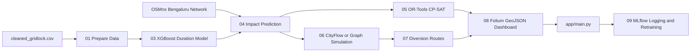

## Quick Start

```bash
python -m venv .venv
. .venv/bin/activate          # Windows: . .venv/Scripts/activate
pip install -r requirements.txt
bash run_all.sh
streamlit run app/main.py
```

The pipeline reads `data/cleaned_gridlock.csv` (already in the repo). Outputs are written to `output/predictions` and `output/dashboards`.

> **Modeling note:** the source data has no event-end timestamp, so impact *duration* is produced by a
> transparent operational risk estimator, not a supervised model. This is a deliberate design choice —
> see [Modeling Approach & Data Limitation](#modeling-approach--data-limitation).

## Modeling Approach & Data Limitation

We want to be explicit about what is and isn't learned from data, because it shapes the whole design.

### The data constraint

`cleaned_gridlock.csv` (8,173 Bengaluru events) contains `start_datetime` and `created_date`, but
**no event-end / resolution timestamp**. There is therefore *no ground-truth label for how long a
congestion event lasted*. A supervised "duration prediction" model is not possible without inventing
a label — and inventing one would produce a confident-looking but meaningless number.

### What we do instead

| Question | Approach | Why |
|----------|----------|-----|
| How long will impact last? | **Transparent operational risk estimator** (`estimate_operational_impact`) combining cause base-minutes × priority × closure × peak-hour × planned/unplanned × corridor × road-context factors | Every factor is inspectable and defensible by an operator; no fabricated label |
| What *can* we learn from the timestamps? | An XGBoost model on `report_creation_delay_min` (start → first report), clearly labeled as such | Honest about what the data actually supports |
| How do we get to a real duration model? | Log actual outcomes via the UI → `data/outcomes.jsonl` → **train a duration model on the real target** (`10_train_from_outcomes.py`) → blend into predictions as outcomes grow | Closes the "no post-event learning system" gap from the problem statement — implemented, not just planned (see `docs/dev/LEARNING_LOOP.md`) |

### Be clear about the reporting-delay model

The XGBoost model currently reports `report_creation_delay_min` with **R² ≈ 0** (MAE ≈ 1.3 min) — i.e.
reporting delay is essentially unpredictable from the available features, and the model is **not** used
for the operational duration estimate. We keep it because (a) it is the only honest supervised target the
data allows, and (b) it exercises the train→log→retrain MLflow loop that a true duration model will use
once outcome data accumulates.

### Why this is the right call for the problem

The problem statement asks to *quantify event impact in advance* and *recommend manpower, barricading,
and diversion* — and flags the absence of a *post-event learning system*. Our value is in the
operational reasoning (graph-based impact propagation, OR-Tools deployment, direct closure-bypass
diversion) plus a working learning loop, **not** in a duration number dressed up as ML. Framing the
estimator transparently and wiring the outcome loop is a more credible, more useful system than a
black-box trained on a proxy label.

## Public Deployment

The Streamlit app is deployment-ready for GitHub-backed hosts. Runtime artifacts such as trained models, GraphML road networks, prediction JSON, dashboards, MLflow local state, and logs are intentionally ignored by Git. On first start, `app/main.py` calls `lib.bootstrap.ensure_runtime_artifacts()` and rebuilds missing artifacts from `data/cleaned_gridlock.csv`.

### Streamlit Community Cloud

1. Push the `event_traffic_system` folder as the repository root, or set the app path to `event_traffic_system/app/main.py` if this folder lives inside a larger repo.
2. Ensure `data/cleaned_gridlock.csv`, `requirements.txt`, `packages.txt`, and `runtime.txt` are committed.
3. Create a new Streamlit app from GitHub.
4. Set the main file path to:

```text
streamlit_app.py
```

If deploying from the parent `flipkart` repository instead, set:

```text
event_traffic_system/streamlit_app.py
```

The first load may take longer while the app prepares data, builds/downloads the OSMnx network, trains the model, and creates default response artifacts. If OSMnx cannot reach Overpass, the project falls back to the deterministic Bengaluru graph.

### Render

Render can use `render.yaml` directly:

```bash
git push origin main
```

Then create a Render Blueprint from the repository. The service runs:

```bash
streamlit run app/main.py --server.address=0.0.0.0 --server.port=$PORT
```

### Docker

```bash
docker build -t bengaluru-congestion .
docker run --rm -p 8501:8501 bengaluru-congestion
```

Open `http://localhost:8501`.

### Do Not Commit

The following are local/generated and should stay out of Git:

- `venv/` or `.venv/`
- `mlruns/`, `mlflow.db`, `mlruns_fallback.jsonl`
- `output/runtime/`, `output/predictions/`, `output/dashboards/`
- `models/*.pkl`
- `road_network/*.graphml`
- Python cache directories

## Live Pipeline Monitor

Start the dependency-free operations dashboard on Windows:

```powershell
.\run_monitor.ps1
```

Or start it directly:

```bash
python app/realtime_monitor.py 8765
```

Open `http://127.0.0.1:8765`. The monitor can start and stop the pipeline, displays each running script, streams combined stdout/stderr, shows model and response metrics, and links every generated artifact. Runtime state and logs are persisted under `output/runtime`.

## Scripts

- `01_prepare_data.py` parses dates, computes `actual_duration_min`, engineers temporal features, encodes boolean/ordinal fields, and writes `data/train_data.csv`.
- `02_build_network.py` downloads the Bengaluru drive network with OSMnx and saves `road_network/bangalore_graph.graphml`; if download fails, it saves a deterministic Bengaluru fallback graph.
- `03_train_duration_model.py` trains `XGBRegressor(enable_categorical=True)`, reports MAE, RMSE, and R2, and saves `models/duration_model.pkl`.
- `04_predict_impact.py` predicts duration and identifies affected roads through corridor propagation, 1 km proximity search, and adjacent edge expansion.
- `05_manpower_optimizer.py` uses OR-Tools CP-SAT and graph centrality to maximize intersection coverage for available officers.
- `06_barricade_simulator.py` uses CityFlow when importable and otherwise applies a graph-based congestion, throughput, and travel-time scorer across three plans.
- `07_diversion_routes.py` removes selected closed edges and computes travel-time weighted alternative routes.
- `08_generate_dashboard.py` writes GeoJSON and `dashboard.html` using Folium.
- `09_mlflow_logger.py` logs metrics, parameters, artifacts, predictions, supports threshold-based retraining, and triggers outcome-based training.
- `10_train_from_outcomes.py` trains a congestion-duration model from operator-logged outcomes (`actual_duration_min`), self-gating on the number of outcomes; `04_predict_impact.py` blends it with the operational estimator, trusting it more as outcomes accumulate.

## CityFlow And Docker

CityFlow is optional because Windows builds can be environment-sensitive. To use native CityFlow, install it in the same environment and place `roadnet.json`, `flow.json`, and `config.json` in `config/cityflow_config`. The simulator automatically falls back to the Python graph engine when CityFlow is unavailable.

```bash
docker build -t bengaluru-congestion .
docker run --rm -p 8501:8501 -v "%cd%/../cleaned_gridlock.csv:/cleaned_gridlock.csv" bengaluru-congestion
```

Inside the container, copy or mount the CSV so `run_all.sh` can read it from the expected parent path, or call `01_prepare_data.py --input /cleaned_gridlock.csv`.

## MLflow Retraining

```bash
python scripts/09_mlflow_logger.py --mode log-latest
python scripts/09_mlflow_logger.py --mode retrain-if-needed --threshold-mae 30
```

Cron example:

```cron
0 2 * * * cd /opt/event_traffic_system && /usr/bin/python scripts/09_mlflow_logger.py --mode retrain-if-needed --threshold-mae 30
*/30 * * * * cd /opt/event_traffic_system && /usr/bin/python scripts/09_mlflow_logger.py --mode log-latest
```

## Streamlit Dashboard

`app/main.py` provides event entry, impact prediction, manpower recommendation, barricade selection, diversion generation, interactive map rendering, outcome logging, and MLflow integration from one screen.

The map renders affected roads, affected intersections, numbered police deployment points, all barricade plan layers, recommended closures, diversion routes, and an on-map legend. Click a road, marker, or route for its explanation and metrics.

## Flipkart Office Scenario Walkthrough

The screenshots below show an example unplanned critical accident near the Flipkart office area around Gear School Road / Bhoganahalli, Bengaluru. This scenario demonstrates the complete operator workflow: entering an event, watching the live pipeline, reading the plain-English response summary, and inspecting individual map layers.

> Note: The exact result depends on the selected road segment. A small location shift can change the road context from a connected through-road to a local access road, which changes whether diversions are recommended.

### 1. Event Entry

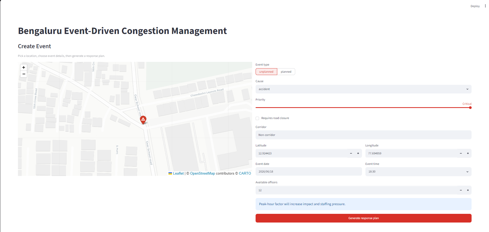

The operator enters an unplanned accident at critical priority, marks the event as non-corridor, selects the Flipkart office location, and sets the time to 18:30. Because this is an evening peak period, the interface warns that peak-hour impact and staffing pressure will increase.

### 2. Live Pipeline Monitor

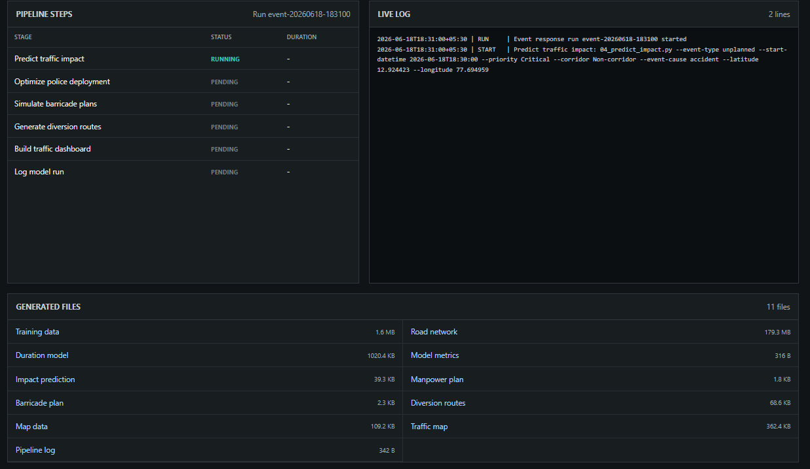

The monitor shows the response pipeline running stage by stage. It displays the active script, status, live log output, and generated artifacts such as training data, model, road network, impact prediction, manpower plan, diversion routes, and map dashboard.

### 3. Plain-English Decision Summary

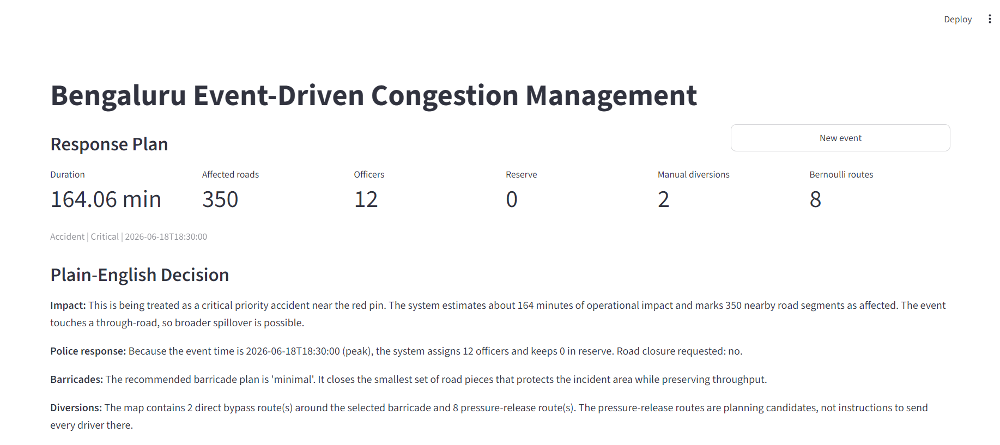

The result screen translates model outputs into an operational response. In this critical peak-hour accident case, the system estimates a longer duration, marks nearby road segments as affected, assigns available officers, recommends a minimal protective barricade plan, and separates direct bypass routes from experimental pressure-release routes.

### 4. Event Creation Screen On Deployment

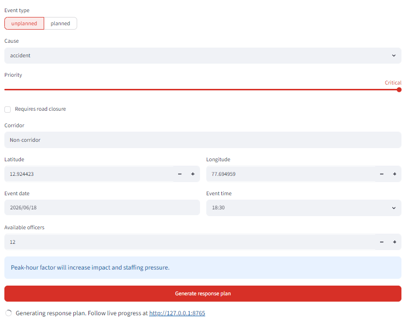

The public Streamlit deployment opens directly into the event creation screen. Operators can pick a location on the map, tune cause/priority/closure settings, and generate a response without manually running scripts.

### 5. Recommended Barricade Layer

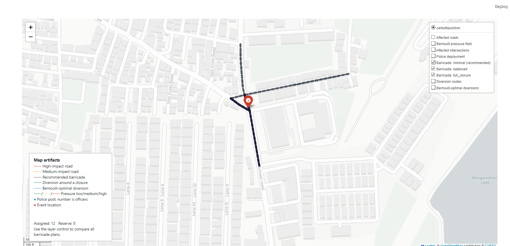

The recommended barricade layer highlights the road edges selected for protection. For a critical accident, this can include a minimal set of segments around the incident point to create a safety buffer while keeping the surrounding network usable.

### 6. Affected Intersections

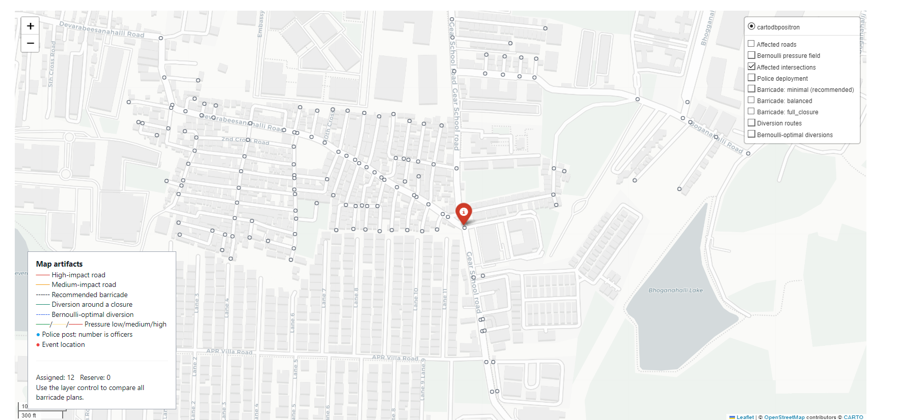

Affected intersections are shown as small markers around the impact area. These are junctions the system considers relevant for observation, traffic control, or possible escalation if congestion spreads.

### 7. Police Deployment

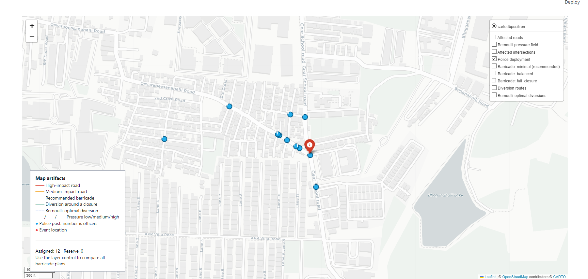

Police deployment points show where officers should be placed. Numbered blue circles indicate recommended officer counts at each junction. In peak-hour critical cases, the optimizer may assign all available officers and keep no reserve.

### 8. Affected Roads

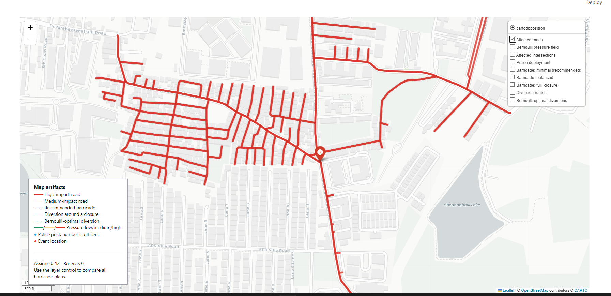

The affected-roads layer shows road segments expected to experience direct slowdown. Red segments are high-impact roads. In this scenario, the event touches a connected through-road network, so the affected area extends beyond the immediate pin.

### 9. Direct Diversion Route (recommended)

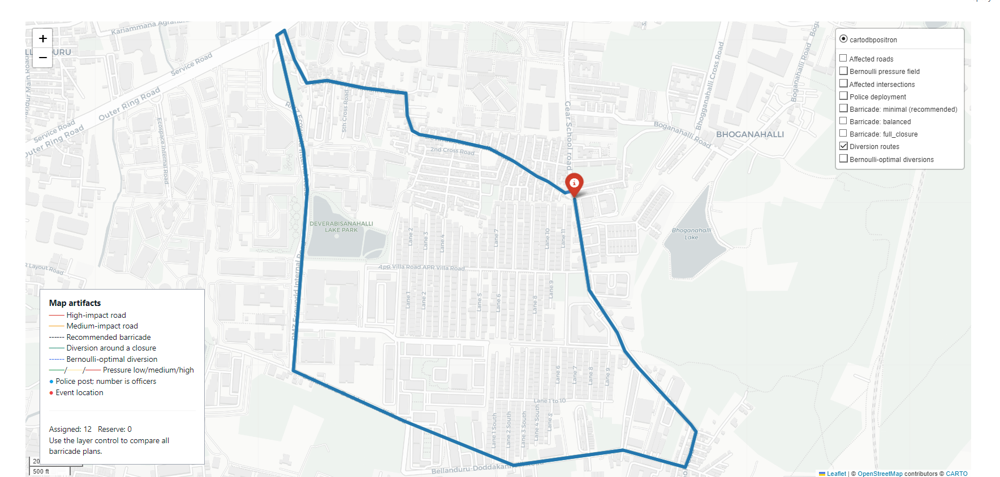

The direct diversion route is the operationally actionable output of the diversion stage — a practical bypass around the affected road/barricade using connected roads near the office area.

### 10. Optional: Experimental Pressure Layer (not part of the core plan)

> Off by default. An experimental planning aside, kept for exploration only — see the appendix below.

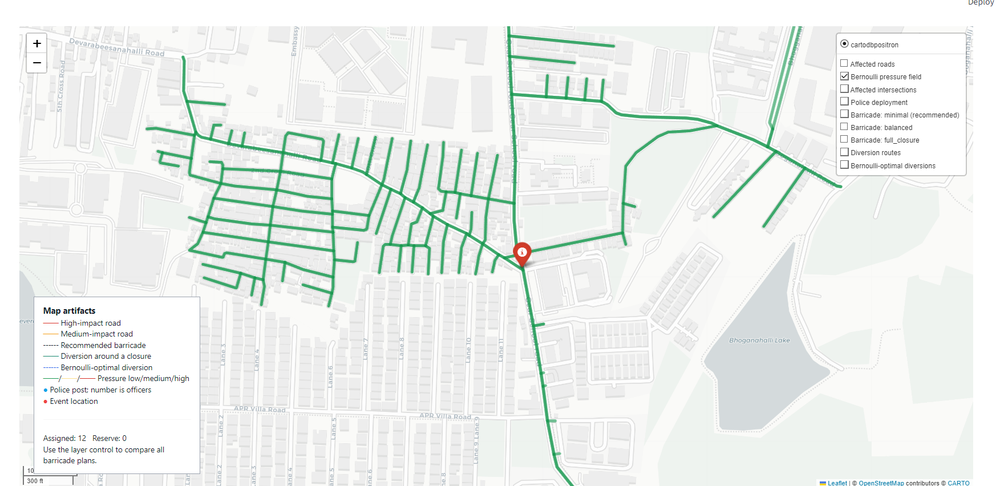
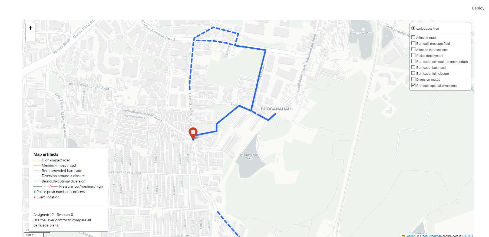

The pressure field colours roads by traffic tension (green low → red high); the dashed blue routes are experimental "pressure-release" candidates, **not** recommended driver instructions. The recommended diversion remains the direct bypass above.

## Appendix: Experimental Pressure-Field Diversion (optional)

> Not a core deliverable. Off by default in the UI. The recommended, actionable diversion is the direct
> closure-bypass route; the pressure-field layer below is an exploratory add-on.

The diversion stage can additionally compute an experimental fluid-dynamics heuristic that treats each
road edge as a flow channel with a Bernoulli-like potential and routes "pressure-release" candidates away
from high-tension nodes. The parameters (`k`, `alpha`, `beta`) are **uncalibrated defaults** — this is a
traffic-fluid analogy, not a calibrated traffic-flow model. Full formula, current values, and the
calibration path are documented in [`docs/dev/BERNOULLI_NOTES.md`](docs/dev/BERNOULLI_NOTES.md).

SUMO integration is optional: if local SUMO binaries and a network file exist under
`config/sumo_config/bangalore.net.xml`, the diversion stage records SUMO capability; otherwise it falls
back to the NetworkX simulation.
